# 택배 추적 시스템 시퀀스 다이어그램

```mermaid
sequenceDiagram
    participant Main as main()
    participant Config as config
    participant YOLO as YOLO Model
    participant Matcher as FIFOGlobalMatcher
    participant API as api_helper
    participant VideoMgr as VideoManager
    participant CSV as CSV Writer
    participant FS as File System
    participant Server as API Server

    Note over Main: 시스템 초기화
    Main->>Config: 디렉토리 생성 (OUT_DIR, VIDEO_DIR, CROP_DIR)
    Main->>YOLO: 모델 로드 (parcel_ver0123.pt)
    Main->>Matcher: FIFOGlobalMatcher 생성
    Main->>VideoMgr: VideoManager 생성
    Main->>CSV: CSV 파일 열기 및 헤더 작성

    loop 각 프레임마다
        Main->>FS: 프레임 이미지 읽기
        Main->>VideoMgr: 비디오 라이터 초기화
        Main->>Main: ROI/EOL 영역 표시

        Main->>YOLO: 객체 탐지 (conf=0.25)
        YOLO-->>Main: 탐지 결과 (boxes)

        loop 각 탐지된 객체마다
            Main->>Main: ROI/EOL 영역 체크
            
            alt 기존 추적 객체 (Local Match 성공)
                Main->>Main: best_uid 찾기 (위치 기반)
                Main->>Matcher: master_id 조회
                Matcher-->>Main: route_code 반환
                Note over Main: event_type = "TRACKING"
            else 신규 객체 (Local Match 실패)
                Main->>Main: local_uid 생성
                
                alt USB_LOCAL 카메라
                    Main->>Main: 스캐너 데이터 생성
                    Main->>API: api_scan(uid, route_code)
                    API->>Server: POST /api/track
                    Server-->>API: 응답
                end
                
                Main->>Matcher: try_match(cam, time_s, width, uid, scanner_data)
                
                alt USB_LOCAL (입구)
                    Matcher->>Matcher: _new_master() 호출
                    Matcher->>Matcher: master 생성 (start_time, total_dist 설정)
                    Matcher->>Matcher: q01 큐에 추가
                    Matcher-->>Main: master_id 반환
                else RPI_USB1
                    Matcher->>Matcher: _try_fifo("q01", ...)
                    Matcher->>Matcher: q01에서 pop, q12에 추가
                    Matcher-->>Main: master_id 반환
                else RPI_USB2
                    Matcher->>Matcher: _try_fifo("q12", ...)
                    Matcher->>Matcher: q12에서 pop, q23에 추가
                    Matcher-->>Main: master_id 반환
                else RPI_USB3
                    Matcher->>Matcher: _try_fifo("q23", ...)
                    Matcher->>Matcher: q23에서 pop, q3e에 추가
                    Matcher-->>Main: master_id 반환
                else RPI_USB3_EOL
                    Matcher->>Matcher: _try_fifo("q3e", ...)
                    Matcher->>Matcher: q3e에서 pop
                    Matcher-->>Main: master_id 반환
                end
                
                alt 매칭 성공
                    Main->>Matcher: route_code 조회
                    Matcher-->>Main: route_code 반환
                    
                    alt RPI_USB3에서 XSEA 경로 감지
                        Main->>API: api_missing(mid)
                        API->>Server: PATCH /api/detect-missing
                        Note over Main: event_type = "MISSING_DETECTED"
                    else EOL 도달
                        Main->>API: api_missing(mid)
                        API->>Server: PATCH /api/detect-missing
                        Main->>API: api_eol(mid)
                        API->>Server: DELETE /api/detect-eol/{uid}
                        Note over Main: event_type = "EOL_REACHED"
                    else 일반 매칭
                        Note over Main: event_type = "MATCHED"
                    end
                else 매칭 실패
                    Note over Main: event_type = "UNMATCHED"
                end
            end
            
            Main->>FS: Crop 이미지 저장 (crop_img)
            Main->>CSV: 로그 기록 (timestamp, cam, local_uid, master_id, route, bbox, event)
            Main->>Main: 영상에 박스 및 라벨 그리기
            Main->>Main: new_active에 객체 정보 저장
        end

        Note over Main: 객체 소멸 감지
        loop 이전 프레임의 객체들
            alt 객체가 사라짐
                Main->>Matcher: master_id 조회
                
                alt XSEA 경로 & RPI_USB2
                    Main->>API: api_pickup(mid)
                    API->>Server: PATCH /api/detect-pickup
                    Main->>Matcher: status = "FINISHED"
                    Note over Main: event_status = "PICKUP_SUCCESS"
                else XSEB 경로 & RPI_USB3
                    Main->>API: api_pickup(mid)
                    API->>Server: PATCH /api/detect-pickup
                    Main->>Matcher: status = "FINISHED"
                    Note over Main: event_status = "PICKUP_SUCCESS"
                else USB_LOCAL 또는 RPI_USB1
                    Note over Main: event_status = "DISAPPEARED"
                end
                
                Main->>CSV: 소멸 이벤트 로그 기록
            end
        end

        Note over Main: 실시간 거리 업데이트 루프
        loop 모든 추적 중인 master 객체
            Main->>Matcher: masters 조회
            alt status == "TRACKING"
                Main->>Main: 경과 시간 계산 (elapsed_time)
                Main->>Config: BELT_SPEED 조회 (0.366 m/s)
                Main->>Main: 이동 거리 계산 (moved_m = elapsed_time * BELT_SPEED)
                Main->>Main: 남은 거리 계산 (remaining_m = total_dist - moved_m)
                
                alt 0.5m 이상 변화 또는 첫 업데이트
                    Main->>Main: 거리 반올림 (0.5m 단위)
                    Main->>API: api_update_position(mid, rounded_m)
                    API->>Server: PATCH /api/detect-position
                    Server-->>API: 응답
                    Main->>Matcher: last_reported_m 업데이트
                end
            end
        end

        Main->>Main: active_tracks 업데이트
        Main->>VideoMgr: 프레임 저장
        VideoMgr->>FS: 비디오 파일에 쓰기
    end

    Note over Main: 종료 처리
    Main->>VideoMgr: release_all()
    VideoMgr->>FS: 비디오 파일 닫기
    Main->>CSV: CSV 파일 닫기
```

## 주요 이벤트 흐름 요약

### 1. 신규 객체 감지 시 (USB_LOCAL)
- YOLO 탐지 → Local Match 실패 → Global Match 시도
- `api_scan()` 호출 → POST /api/track
- `_new_master()` 생성 → master 객체 생성 및 q01 큐에 추가

### 2. 카메라 간 이동 추적
- USB_LOCAL → RPI_USB1: q01에서 매칭, q12로 이동
- RPI_USB1 → RPI_USB2: q12에서 매칭, q23로 이동  
- RPI_USB2 → RPI_USB3: q23에서 매칭, q3e로 이동
- RPI_USB3 → EOL: q3e에서 매칭, `api_eol()` 호출

### 3. 실시간 거리 업데이트
- 매 프레임마다 모든 TRACKING 상태 객체 체크
- 경과 시간 × 벨트 속도로 이동 거리 계산
- **0.5m 이상 변화 시** `api_update_position()` 호출
- PATCH /api/detect-position 전송

### 4. 객체 소멸 시
- XSEA 경로 + RPI_USB2: `api_pickup()` 호출
- XSEB 경로 + RPI_USB3: `api_pickup()` 호출
- status를 "FINISHED"로 변경하여 거리 업데이트 중지
